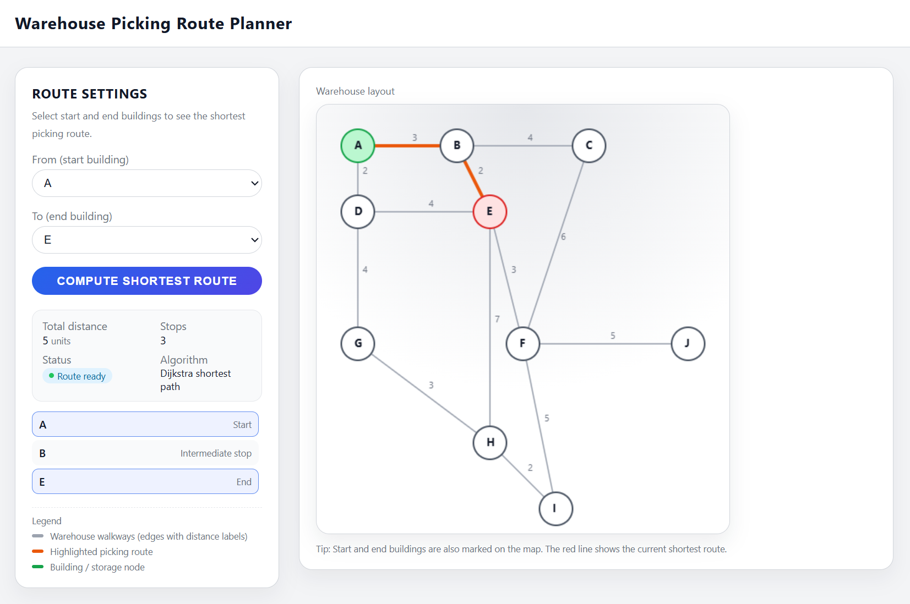

# 📦 Warehouse Picking Route Planner

**Warehouse Picking Route Planner** that demonstrates how to compute the shortest path between two buildings using **Dijkstra’s Algorithm** on a **graph data structure**. It also visualizes the graph layout on a canvas with predefined coordinates.

## 📹 Introduction Video
https://youtu.be/3kZBG3qPhSE

---

## 🚀 Features
- Interactive web interface built with **Flask**.
- Graph represented as an **adjacency list**.
- Hard-coded coordinates for visualization because the buildings are fixed.
- **Dijkstra’s Algorithm** implementation for shortest path calculation.
- REST API endpoint (`/shortest-path`) returning JSON results.

---

## Graph Data Structure & Dijkstra’s Algorithm

### 📌 Graph Data Structure

In this project, the **graph** is represented using an **adjacency list**.  
Each node (building) is a key in a dictionary, and its value is a list of tuples representing **neighbors** and the **distance (weight)** to them. The graph is **undirected**, so connections work both ways between buildings.


#### Example Representation

```python
GRAPH = {
    "A": [("B", 3), ("D", 2)],
    "B": [("A", 3), ("C", 4), ("E", 2)],
    "C": [("B", 4), ("F", 6)],
    ...
}
```

- **Nodes**: Buildings labeled `A, B, C, ... J`
- **Edges**: Weighted connections between nodes (e.g., `A → B` has weight `3`)
- **Weights**: Distances between buildings

---

### 📌 Dijkstra’s Algorithm

Dijkstra’s Algorithm is used to find the **shortest path** between two nodes in a weighted graph (with non-negative weights).

#### Steps of the Algorithm

1. **Initialization**:
    
    - Set all distances to infinity (`∞`), except the start node (distance = 0).
    - Use a **priority queue (min-heap)** to always expand the node with the smallest known distance.
2. **Relaxation**:
    
    - For each neighbor of the current node, calculate the new distance.
    - If the new distance is smaller than the previously recorded distance, update it and push the neighbor into the priority queue.
3. **Termination**:
    
    - Continue until the destination node is reached or all nodes are processed.

---


### 📊 Example Walkthrough: Shortest Path from **A → E**

We want to find the shortest path from **A** to **E**.

#### Step 1: Initialization

- Distance(A) = 0
- Distance(B, C, D, E, …) = ∞

#### Step 2: First Expansion (A)

Neighbors of A:

- B = 0 + 3 = 3
- D = 0 + 2 = 2

|Node|A|B|D|E|
|---|---|---|---|---|
|Dist|0|3|2|∞|

#### Step 3: Expand D (smallest distance = 2)

Neighbors of D:

- E = 2 + 4 = 6
- G = 2 + 4 = 6

|Node|A|B|D|E|G|
|---|---|---|---|---|---|
|Dist|0|3|2|6|6|

#### Step 4: Expand B (distance = 3)

Neighbors of B:

- E = 3 + 2 = 5 (better than 6 → update)

|Node|A|B|D|E|G|
|---|---|---|---|---|---|
|Dist|0|3|2|**5**|6|

#### Step 5: Expand E (distance = 5)

Reached destination → shortest path found.

### ✅ Result

- Shortest Path: **A → B → E**
- Total Distance: **5**

#### Why not A → D → E?

- A → D → E = 2 + 4 = 6
- A → B → E = 3 + 2 = **5** (shorter)

**priority queue table** showing how Dijkstra’s algorithm processes the nodes step by step:

|Step|Queue (Node, Distance)|Action Taken|Updates|
|---|---|---|---|
|Init|(A,0), (B,∞), (C,∞), (D,∞), (E,∞), (G,∞)|Start at A|Distance(A)=0|
|1|(D,2), (B,3), (C,∞), (E,∞), (G,∞)|Expand A|B=3, D=2|
|2|(B,3), (E,6), (G,6), (C,∞)|Expand D (smallest=2)|E=6, G=6|
|3|(E,5), (G,6), (C,∞)|Expand B (next smallest=3)|E updated to 5 (better than 6)|
|4|(G,6), (C,∞)|Expand E (distance=5)|Destination reached|


**Key Insight**

- The priority queue ensures nodes are always expanded in **order of smallest known distance**.
- Even though **D** was closer initially (2 vs. 3), the algorithm still expands **B** afterward because it’s the next smallest.
- That’s how it finds the shorter path **A → B → E = 5**, instead of stopping at **A → D → E = 6**.
- Dijkstra’s Algorithm is a **Greedy Algorithm** which always expands the node with the smallest known distance first.
- This greedy choice ensures the shortest path is found correctly.

---

### 📌 Time Complexity

- Using a **min-heap priority queue**:
    - Each edge relaxation: (O(log V))
    - Total complexity:  
        [ O((V + E) * log V) ]
- Where:
    - (V) = number of vertices (nodes)
    - (E) = number of edges

For dense graphs, this is efficient compared to a simple array-based implementation.

---

### 🖥️ How to Run
```bash
cd Task2
pip install -r requirements.txt
python main.py
```

Access the app at:  
👉 http://127.0.0.1:5000
